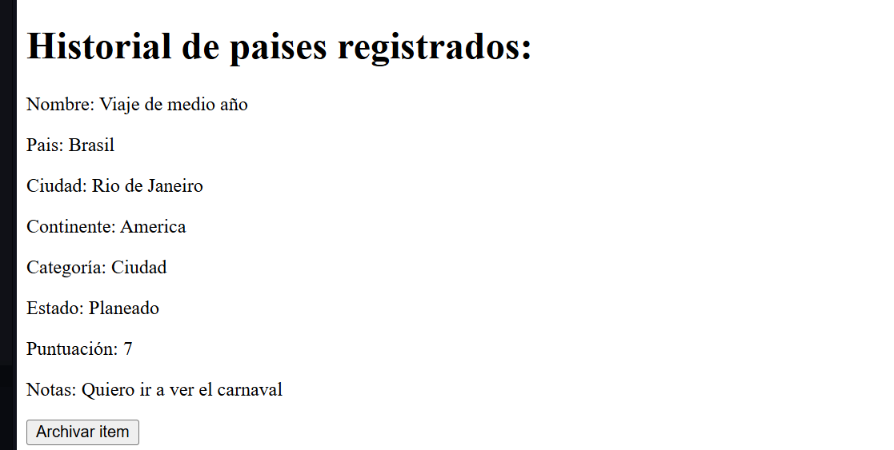
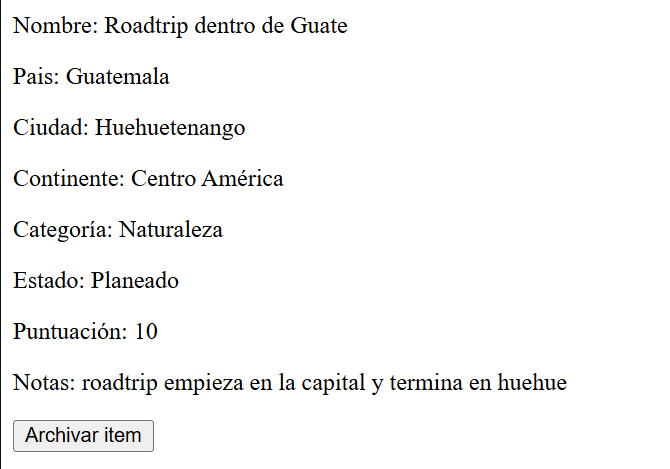
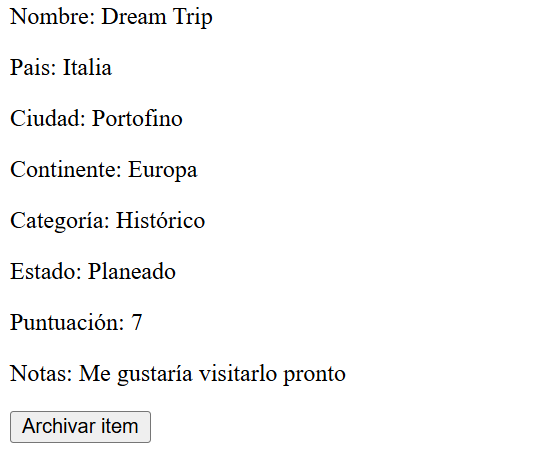
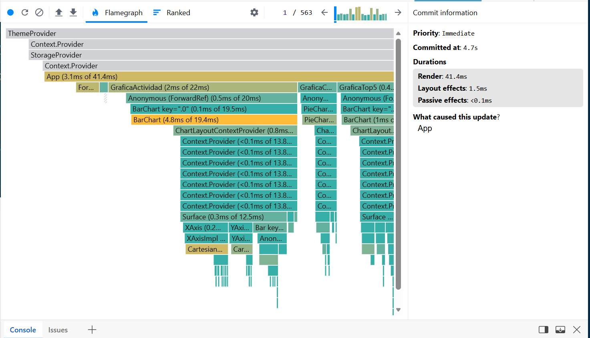
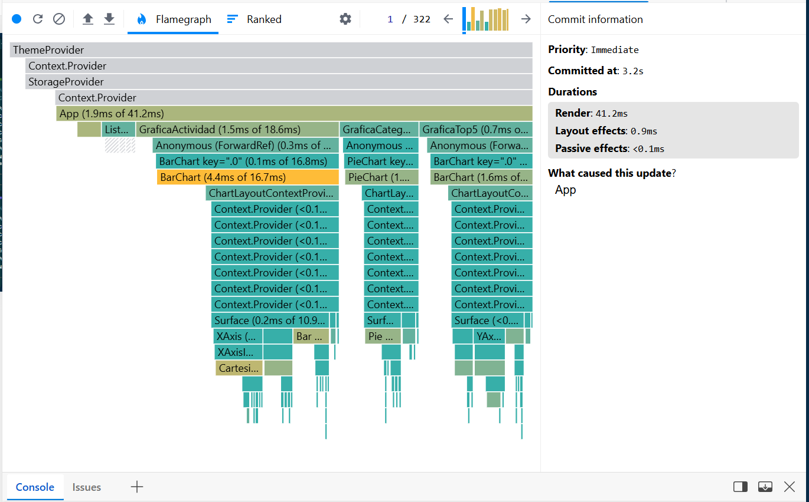

# Mi Colección de Viajes

Aplicación web para registrar viajes con destinos visitados y pendientes. Hecha con React + Vite en el frontend y Express + better-SQLite3 en el backend.


## Mis primeros Items






## Stack

- **Frontend:** React 18 + Vite
- **Estilos:** CSS (falta)
- **Backend:** Node.js + Express
- **Base de datos:** SQLite (better-sqlite3)


## Cómo correr el proyecto

**Frontend:**
```
cd frontend
npm install
npm run dev
```

**Backend:**
```
cd backend
npm install
node src/index.js
```

El frontend corre en `http://localhost:5173` y el backend en `http://localhost:3001`.


## Endpoints del backend

| Método | Ruta | Descripción |
|--------|------|-------------|
| GET | /api/items | Trae todos los destinos activos |
| POST | /api/items | Agrega un destino nuevo |
| PUT | /api/items/:id | Actualiza un destino |
| DELETE | /api/items/:id | Archiva un destino |
| POST | /api/items/:id/registro | Registra días en un destino |

# FASE 2
## Explicación de colores CSS

En general me guié de la playa para escoger los colores, también usé la herrmienta de Adobe Color para guiarme y escoger un tema como lo que quería. (https://color.adobe.com/create/color-wheel)

### Tema Claro

    --fondo: #F6ECD9;
Para el fondo escogí un color crema para que no sea tan contrastante como el planco y se vea playero, cálido y tranquilo todo

    --fondoCard: #FFFDF7;
Para el fondo de las tarjetas utilicé un color igual crema pero un poco mas clarito para que se notara la diferencia

    --acentoPrincipal: #1D6E7E;
Con este color traté de simbolizar un poco el mar y las olas. Traté de que fuera del mismo tono que el crema para que así combinara

    --textoFuerte: #103C44;
Este es como el color anterior pero un poco mas oscuro para que también se pierda un poco más en el diseño y no se sienta tan forzado

    --acentoSecundario: #E08B6A;
Este lo seleccioné para que hiciera un acento y destacara dentro de los demás colores pero aún que pareciera la vibra como playera y de atardecer

    --texto: #173A3F;
Este color lo seleccioné para que combinara con los azules del mar que tenia antes pero mas oscuro para que el texto se viera bien.


### Tema Oscuro

    --fondo: #0A2429;
Para el fondo del tema oscuro utilicé esta misma temática del mar y de los azules como grisáceos para que parezca un mar más profundo, más oscuro

    --fondoCard: #0F3840;
Para el fondo de tarjetas o fondo secundario dejé este mismo azul pero más claro para que fuera sutil la diferencia contra el fondo general

    --acentoPrincipal: #3AA9C0;
Este color de acento lo elegí por que resalta bastante entre los demás azules al ser más claro y brillante 

    --acentoSecundario: #E08B6A;
Este acento lo dejé igual que en el tema claro para que tuviera un poco de concordancia entre ambos y así mantener el tema de atardecer/playa

    --texto: #EAF4EE;
Este color es casi blanco pero un poco verdoso para que no sea tan shokeante o contrastante

    --textoFuerte: #386870;
Este lo tome como segundo texto para que fuera un poco mas claro que el fondo-card pero no tanto para que no se viera tan fuera de lugar

# Fase 3

## Capturas y análisis de profiler

### Antes:

Antes al escribir cada letra en el buscador cambiaba el estado y los items se recalculaban como que si fueran una variable normal, entinces la lista recibía un nuevo array y ver item se volvia a renderizar cada vez aunque los datos no hubieran cambiado. Por eso se ven las barras de render en cada tarjeta de la lista. 

### Después:

Ahora los items se recalculan solo cuando cambian sus dependencias reales como lista, busqueda o filtros.Las tarjetas en donde el prop no cambió se saltan. Por eso el profiler muestra menos componentes marcados por el render cuando se recibe, como por ejemplo los de VerItem, pues filtrar no crea nuevos objetos si no que solo excluye los items que no interesa ver.

## Mi gráfica Original
Yo me decidí por usar una gráfica que muestra cuántos destinos se registraron cada día de los últimos 7 días. Esta se llama GraficaActividad. Lo elegí para que se pueda mantener visualmente la cantidad de viajes registrados y asi ver que tal estuvo la semana.

## Mis 3 decisiones técnicas 
### Estrucutra del reducer
Para el reducer usé para cada filtro una acción separada tipo por categoría o por estado y para buscar, luego para filtro le pasé campo y valor  para que el reducer aplique el cambio con el estado, accion.payload.campo: accion.payload.valor. Eso lo hice para que se mantuviera en 7 acciones y no se alargara a tanto.

### Acción más difícil
Para mí la más difícil fue la de registrarActividad por que no podía modificar el objeto directamente asi que tuve que usar map para recorrer la lista, entonces ya cuando map identificaba que el ID era igual devolvía el objeto nuevo del item + el campo actualizado { ...i, fechaActividad: accion.payload.fecha }

### Gráfica más compleja
La gráfica más compleja fue la del top 5 ya que tenía que filtrar a los de puntuación, luego ordenarlos de mayor a menor y luego tomar solo los primeros 5. Luego además buscar el color de su categoría en el arreglo, por que así la barra cambia de color según la categoría y puede mostrar a que tipo de lugar pertenece cada uno.

# Fase 4

## URLs del proyecto desplegado

- **Frontend (Vercel):** url
- **Backend (Render):** url pendiente

## Hooks personalizados

| Hook | Parámetros | Retorna | Dónde se usa |
|------|-----------|---------|--------------|
| `useLocalStorage` | `clave`, `inicial` | `[valor, setValor]` | ThemeProvider |
| `useFetch` | `url` | `{ data, cargando, error }` | App |
| `useAtajoTeclado` | `tecla`, `alPresionar`, `opciones` | nada | App, FormularioItem |
| `useEstadisticasViaje` | `items` | `{ total, visitados, planeados, promedio }` | App |

## Variables de entorno

## Sobre mí

### Nombre
Mariana Castañeda
### Carnet
24481
### Semestre
Quinto Semestre
### Reflexión
En general me pareció muy interesante el curso, me llama mucho la atención el tema de react y me gustaría enfocarme en aprender más y lograr ser fullstack por lo que este proyecto me ayudó mucho a entender varios temas. Lo que más se me dificultó fue unir todo y tener que aprender la sintaxis tanto de javascript como de jsx, me gustó que combinara varios lenguajes y que se puede hacer tanto html como javascript. Siento que se me dificultó un poco el tener que aprender tantos temas en el poco tiempo del semestre pero a pesar de eso si aprendí bastante.


